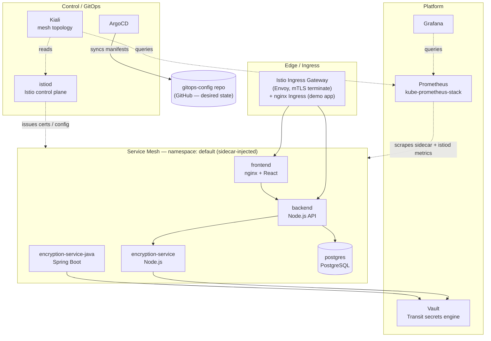
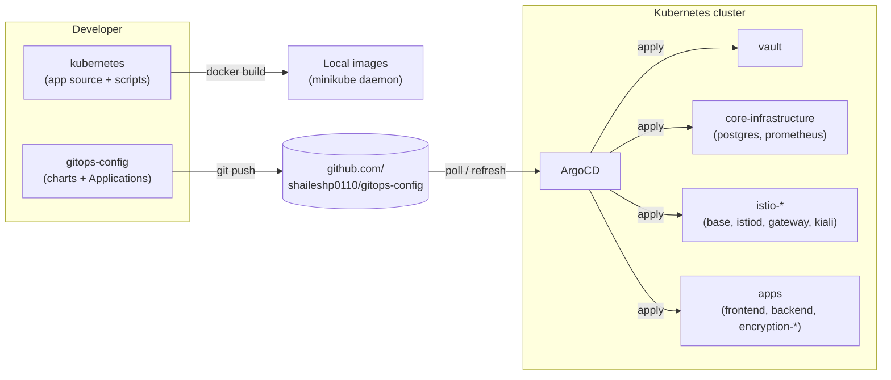
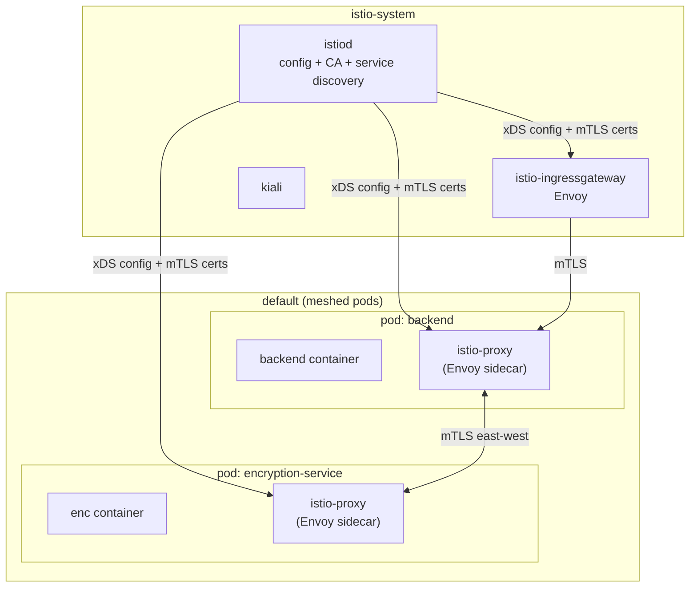
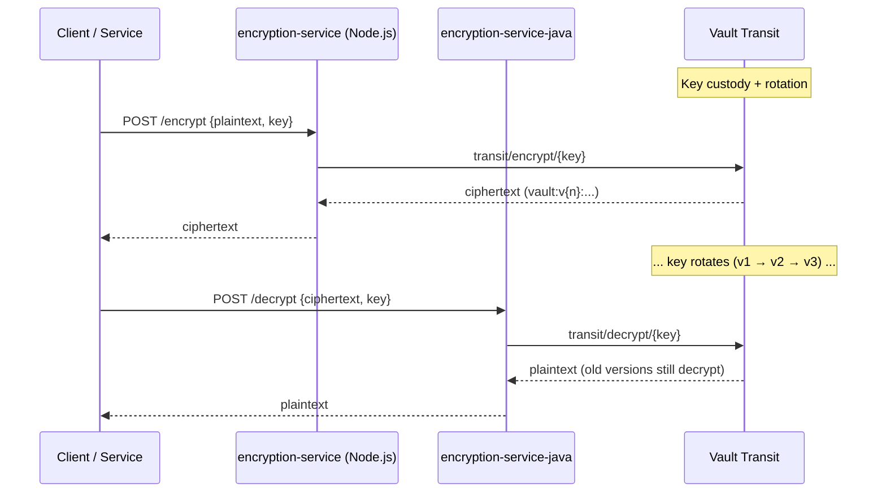
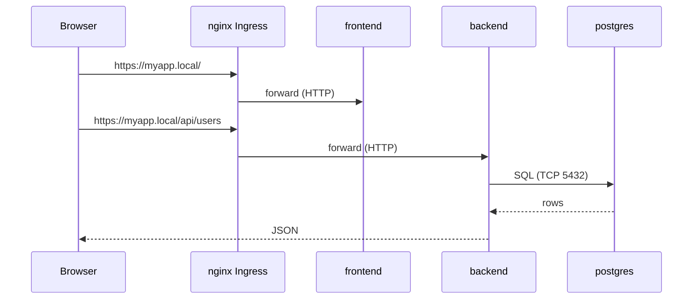
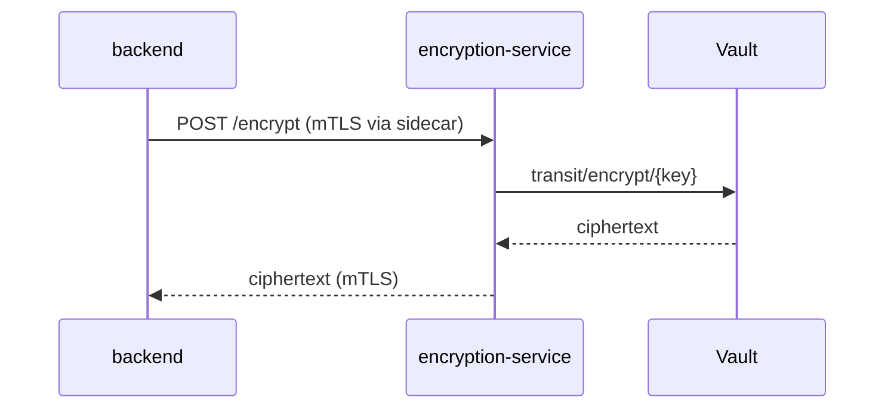
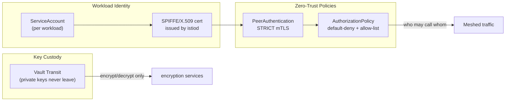
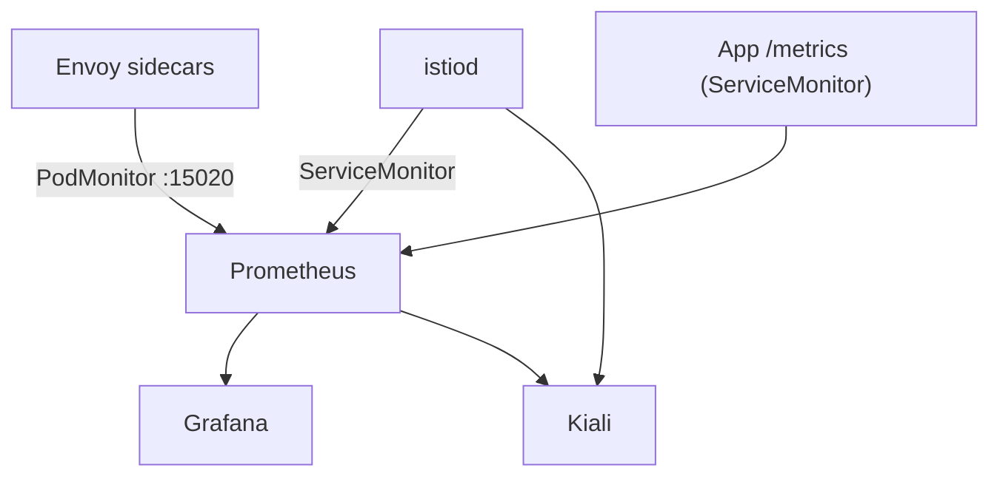

# Project Architecture

A GitOps-driven, service-meshed platform demonstrating **encryption-as-a-service** with
HashiCorp Vault, multi-language workloads, and a zero-trust Istio service mesh — all
reconciled by ArgoCD from a declarative config repository.

---

## Table of Contents

1. [High-Level View](#high-level-view)
2. [Layered Architecture](#layered-architecture)
3. [Repositories & GitOps Flow](#repositories--gitops-flow)
4. [Service Mesh (Istio)](#service-mesh-istio)
5. [Encryption-as-a-Service (Vault Transit)](#encryption-as-a-service-vault-transit)
6. [Component Inventory](#component-inventory)
7. [Request & Data Flows](#request--data-flows)
8. [Security Model](#security-model)
9. [Observability](#observability)
10. [Namespaces & Mesh Membership](#namespaces--mesh-membership)
11. [Deployment Order (Sync-Waves)](#deployment-order-sync-waves)
12. [Local Setup & Operations](#local-setup--operations)
13. [Operations Cheat Sheet](#operations-cheat-sheet)

---

## High-Level View



---

## Layered Architecture

| Layer | Technology | Responsibility |
|-------|-----------|----------------|
| **Edge** | Istio Ingress Gateway + nginx Ingress | North-south entry, mTLS termination, routing; `minikube tunnel` exposes localhost |
| **Service Mesh** | Istio (Envoy sidecars) | East-west mTLS, authorization, traffic telemetry |
| **Application** | Node.js, Spring Boot, React/nginx | Business logic, encryption API, UI |
| **Secrets / Crypto** | HashiCorp Vault (Transit) | Key custody, encrypt/decrypt, key rotation |
| **Data** | PostgreSQL (Bitnami legacy) | Relational persistence |
| **Observability** | Prometheus, Grafana, Kiali | Metrics, dashboards, mesh topology |
| **Delivery / Control** | ArgoCD, istiod | GitOps reconciliation, mesh config & certs |

---

## Repositories & GitOps Flow

Two-repo pattern: source code and deployment configuration are separated.



**GitOps contract**

- `gitops-config` is the single source of truth for cluster state.
- ArgoCD Applications point at the GitHub repo (`repoURL`) and reconcile continuously.
- Local images (`pullPolicy: Never`) are built into the minikube Docker daemon so the
  demo runs without pushing to a registry.
- Sync-wave annotations order installation so dependencies (CRDs, control plane) exist
  before dependents.

> Note: `clusters/local-cluster/local-dev-{frontend,backend}.yaml` override image values so
> local minikube images are used without first pushing the values change to GitHub. The
> app-of-apps `dev-environment.yaml` intentionally excludes frontend/backend for local runs.

---

## Service Mesh (Istio)

### Control plane vs data plane

The Istio control plane (istiod) programs Envoy sidecars and the ingress gateway, and issues
mTLS certs. The **Istio ingress gateway** is the mesh-native edge; the demo app also keeps the
nginx Ingress addon for its `myapp.local` host routing.



> **Version note:** base, istiod, and gateway are pinned together at **1.27.1** so control
> and data plane stay aligned. Older gateway chart schemas fail under ArgoCD's Helm v4 renderer.

### What the mesh provides here

| Capability | Mechanism | Where configured |
|-----------|-----------|------------------|
| **mTLS everywhere** | `PeerAuthentication` → `STRICT` | `istio-config/mesh-mtls.yaml` |
| **Deny-all + allow-list authz** | `AuthorizationPolicy` `{}` + explicit ALLOW rules | `istio-config/mesh-authz.yaml` |
| **Local nginx ingress workaround** | Port-level `PERMISSIVE` on app HTTP ports | `istio-config/mesh-local-ingress.yaml` |
| **Traffic telemetry** | `ServiceMonitor` (istiod) + `PodMonitor` (Envoy :15090) | `istio-config/mesh-metrics.yaml` |
| **Edge routing** | `istio-ingressgateway` (mesh) + nginx Ingress (demo host) | `istio.yaml` |
| **Topology UI** | Kiali reading istiod + Prometheus | `istio.yaml` |

### Sidecar injection & opt-out

- Namespaces labeled `istio-injection=enabled` receive an `istio-proxy` sidecar per pod.
- The `istio-sidecar-injector` (part of istiod) does this automatically at pod creation.
- **Ephemeral/demo pods** (e.g. the `curl-test` pods in the rotation scripts) opt out with:

```yaml
sidecar.istio.io/inject: "false"
```

  so they terminate cleanly under `kubectl run --rm -i`. This is already applied in
  `demo-rotation.sh`, `demo-rotation-n.sh`, and `demo-rotation-v1-v3.sh`.

---

## Encryption-as-a-Service (Vault Transit)

Vault holds key material; application services never see the master key.



- **Symmetric (`aes256-gcm96`)** and **asymmetric (`rsa-2048`)** demo keys.
- **Rotation without re-encryption**: Transit retains prior key versions, so ciphertext
  produced at `v1` still decrypts after rotating to `v3+`. Proven by the rotation scripts.
- **Multi-language interop**: Node.js encrypts, Java decrypts (and vice-versa) via the
  shared Transit API.

---

## Component Inventory

| Component | Kind | Namespace | In Mesh | Notes |
|-----------|------|-----------|:-------:|-------|
| istiod | Deployment | `istio-system` | — | Control plane: config + CA |
| istio-ingressgateway | Deployment | `istio-system` | — | Mesh edge proxy (Envoy) |
| nginx-ingress-controller | Deployment | `ingress-nginx` | — | Demo app host routing (minikube addon) |
| kiali | Deployment | `istio-system` | ✓ | Mesh topology / traffic UI |
| frontend | Deployment | `default` | ✓ | React + nginx |
| backend | Deployment | `default` | ✓ | Node.js REST API → postgres |
| encryption-service | Deployment | `default` | ✓ | Node.js → Vault |
| encryption-service-java | Deployment | `default` | ✓ | Spring Boot → Vault |
| postgres | StatefulSet | `default` | ✗ | Bitnami legacy image; out of mesh |
| vault | StatefulSet | `vault` | ✗ | Transit engine; out of mesh |
| prometheus | StatefulSet | `monitoring` | ✗ | kube-prometheus-stack |
| grafana | Deployment | `monitoring` | ✗ | Dashboards |
| alertmanager | StatefulSet | `monitoring` | ✗ | Alerting |
| argocd-server + controllers | Deploy/Stateful | `argocd` | ✗ | GitOps engine |

**Mesh membership rule:** application traffic carriers (frontend, backend, encryption-*) are
meshed. Platform/control components (Vault, postgres, prometheus, grafana, argocd) are kept
outside the mesh to isolate the secret store and avoid control-plane coupling.

---

## Request & Data Flows

### End-user request (north-south)



### Encryption call (east-west, meshed)



---

## Security Model



**Principles**

- **Zero-trust**: no implicit trust between pods; every meshed call is mutually authenticated.
- **Default-deny**: `AuthorizationPolicy {}` blocks everything; explicit allow rules open only
  required paths (ingress → apps, backend → postgres, prometheus → scrape).
- **Key isolation**: Vault Transit keeps private/master keys server-side; apps only call
  encrypt/decrypt. Per-key policies can scope which service uses which key.
- **Separation of concerns**: secret store (Vault) and data store (postgres) run outside the
  mesh to reduce blast radius of mesh misconfiguration.

**Migration path (safe rollout):** apply policies in `PERMISSIVE` mTLS first, observe traffic in
Kiali, then flip `PeerAuthentication/default` to `STRICT`. A later step moves authorization from
namespace-level to per-`ServiceAccount` for finer-grained control.

---

## Observability



- **Prometheus** scrapes istiod (control plane), Envoy sidecars (data plane), and app metrics.
- **Grafana** renders dashboards (`kube-prometheus-stack`).
- **Kiali** visualizes mesh topology, traffic, and mTLS status by combining istiod config with
  Prometheus telemetry.

---

## Namespaces & Mesh Membership

| Namespace | `istio-injection` | Purpose |
|-----------|:---:|-----------|
| `default` | enabled | Application workloads |
| `istio-system` | — | Control plane, gateway, Kiali |
| `vault` | disabled | Secret store |
| `monitoring` | disabled | Prometheus/Grafana/Alertmanager |
| `argocd` | disabled | GitOps engine |
| `kube-system` | disabled | Cluster internals |

---

## Deployment Order (Sync-Waves)

ArgoCD `sync-wave` annotations enforce installation order so dependencies exist first.

| Wave | Application | Depends on |
|:----:|-------------|-----------|
| -10 | `istio-base` (CRDs) | — |
| -9 | `istiod` | istio-base |
| -8 | `istio-ingressgateway` | istiod |
| -7 | `kiali` | istiod, prometheus |
| -6 | `istio-config` | istiod |
| 0 | `vault` | — |
| 1 | `postgres`, `kube-prometheus-stack` | — |
| 2 | `frontend-dev`, `backend-dev` | postgres |
| 5 | `encryption-service`, `encryption-service-java` | vault |

`istio-config/` (kustomize: mTLS + deny-all authz + metrics) is synced by the
`istio-config` Argo CD Application (wave -6). `setup-istio.sh` waits for it and can
bootstrap from the local tree if gitops-config has not been pushed yet.

---

## Local Setup & Operations

### Bootstrap

```bash
cd apps
./infrastructure/setup-minikube.sh     # cluster + images + ArgoCD + Vault + apps
./infrastructure/setup-istio.sh        # service mesh (idempotent)
```

### Access UIs

```bash
# ArgoCD
kubectl port-forward svc/argocd-server -n argocd 8080:443     # https://localhost:8080

# Kiali
kubectl port-forward svc/kiali -n istio-system 20001:20001    # http://localhost:20001

# Grafana
kubectl port-forward svc/kube-prometheus-stack-grafana -n monitoring 3000:80
```

### Demos

```bash
./infrastructure/demo-rotation.sh            # single rotation, sym + asym
./infrastructure/demo-rotation-n.sh 2        # encrypt v1, rotate N, decrypt
./infrastructure/demo-rotation-v1-v3.sh      # encrypt v1 & v3, rotate, decrypt both
```

### Teardown

```bash
minikube stop          # pause, keep state
minikube delete        # full teardown
minikube delete --all --purge   # remove all profiles + cached images
```

---

## Operations Cheat Sheet

Day-to-day commands for checking status, logs, health, and troubleshooting.

### Cluster & node status

```bash
kubectl cluster-info                          # control plane + CoreDNS endpoints
kubectl get nodes -o wide                     # node status, IP, version
kubectl top nodes                             # node CPU/memory (needs metrics-server)
kubectl get pods -A                           # every pod, every namespace
kubectl get events -A --sort-by=.lastTimestamp  # recent cluster events
minikube status                               # minikube host/driver state
```

### Application health (default namespace)

```bash
kubectl get pods -n default                   # app pods; 2/2 = meshed (app + sidecar)
kubectl get deploy,svc,hpa -n default         # deployments, services, autoscalers
kubectl get hpa -n default                    # HPA current/target CPU and replica counts
kubectl describe pod <pod> -n default         # events, image pulls, probes for one pod
kubectl rollout status deployment/<name> -n default   # rollout progress
```

### Logs

```bash
# App container logs (meshed pods have two containers: app + istio-proxy)
kubectl logs -n default -l app.kubernetes.io/instance=backend-dev -c microservice --tail=50
kubectl logs -n default -l app.kubernetes.io/instance=encryption-service-dev -c microservice -f

# Follow a single pod
kubectl logs -n default <pod> -c microservice -f

# Previous container (after a crash/restart)
kubectl logs -n default <pod> -c microservice --previous

# All pods for an app at once
kubectl logs -n default -l app.kubernetes.io/instance=frontend-dev --all-containers --tail=20
```

### Service mesh (Istio)

```bash
kubectl get pods -n istio-system                       # istiod, ingressgateway, kiali
kubectl get peerauthentication -A                      # mTLS modes (STRICT / PERMISSIVE)
kubectl get authorizationpolicy -A                     # allow/deny rules
kubectl get destinationrule,virtualservice,gateway -A  # traffic config
kubectl get svc istio-ingressgateway -n istio-system   # edge external IP (minikube tunnel)

# Sidecar (Envoy) logs for a meshed pod
kubectl logs -n default <pod> -c istio-proxy --tail=50

# istiod control-plane logs
kubectl logs -n istio-system -l app=istiod --tail=50
```

### ArgoCD (GitOps)

```bash
kubectl get applications -n argocd                     # sync + health for all apps
kubectl describe application <name> -n argocd          # sync status, conditions, events
kubectl -n argocd get secret argocd-initial-admin-secret \
  -o jsonpath="{.data.password}" | base64 -d; echo     # admin password

# Force an app to re-read its source and re-sync
kubectl -n argocd patch application <name> --type merge \
  -p '{"metadata":{"annotations":{"argocd.argoproj.io/refresh":"hard"}}}'
```

### Vault (secrets / Transit)

```bash
kubectl get pods -n vault                              # vault-0 + agent injector
kubectl logs -n vault vault-0 --tail=50                # Vault server logs
kubectl exec -n vault vault-0 -- vault status          # sealed? HA? version
kubectl exec -n vault vault-0 -- vault list transit/keys           # list Transit keys
kubectl exec -n vault vault-0 -- vault read transit/keys/<key>     # key versions/metadata
```

### Observability (Prometheus / Grafana)

```bash
kubectl get pods -n monitoring                         # prometheus, grafana, alertmanager
kubectl get servicemonitor,podmonitor -A               # what Prometheus is scraping
kubectl top pods -n default                            # per-pod CPU/memory (metrics-server)
kubectl get --raw /apis/metrics.k8s.io/v1beta1/pods    # raw metrics API
```

### Networking / connectivity debugging

```bash
kubectl get svc,endpoints -n default                   # service -> pod IP mapping
kubectl describe svc <name> -n default                 # selector + endpoints
kubectl get ingress -A                                 # ingress rules (myapp.local)

# Throwaway curl pod (opted out of the mesh so it exits cleanly)
kubectl run curl-test --image=curlimages/curl --rm -i --restart=Never --quiet \
  --overrides='{"metadata":{"annotations":{"sidecar.istio.io/inject":"false"}}}' \
  -- curl -s http://encryption-service.default.svc.cluster.local:3000/

# Warm meshed test pod (to test mTLS paths)
kubectl run mesh-test --image=curlimages/curl --restart=Never \
  --overrides='{"metadata":{"annotations":{"sidecar.istio.io/inject":"true"}}}' \
  --command -- sleep 300
kubectl exec mesh-test -- curl -s http://encryption-service.default.svc.cluster.local:3000/
kubectl delete pod mesh-test
```

### Common quick checks

```bash
# Is everything Running / Ready?
kubectl get pods -A | grep -vE "Running|Completed"

# Anything crash-looping?
kubectl get pods -A --field-selector=status.phase!=Running

# Restart an app (e.g. to pick up a rebuilt local image)
kubectl rollout restart deployment/<name> -n default
```

---

### Related docs

- `walkthrough.md` — guided demo flow and rotation scenarios
- `README.md` — original cluster + ArgoCD setup reference
