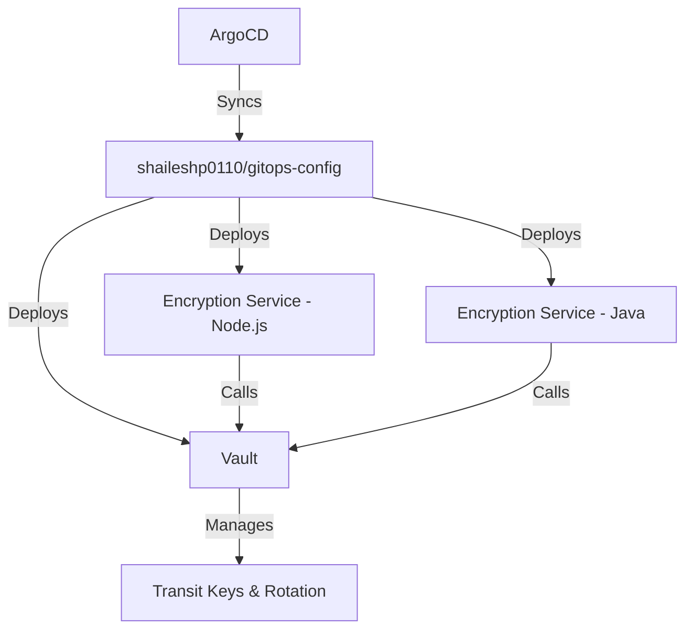

# Vault Key Rotation Demo — GitOps Walkthrough

I have implemented a production-grade GitOps architecture using two GitHub repositories and HashiCorp Vault.

> **Full system diagram & deep-dive:** see [`ARCHITECTURE.md`](./ARCHITECTURE.md) — layered
> architecture, Istio service mesh, security model, data flows, and operations.

## Architecture

This setup uses a dual-repository pattern:
1.  **Source Repo**: [shaileshp0110/kubernetes](https://github.com/shaileshp0110/kubernetes) - Contains application code and setup scripts.
2.  **Config Repo**: [shaileshp0110/gitops-config](https://github.com/shaileshp0110/gitops-config) - Contains Helm charts and ArgoCD Application manifests.

### Component Diagram


## Key Features

- **Dual-Key Support**: Demonstrates rotation for both **Symmetric (AES-256)** and **Asymmetric (RSA-2048)** keys.
- **Multi-Language Demo**: Proves interoperability between Node.js and Java using Vault as a shared encryption provider.
- **Full GitOps**: Uses the "App of Apps" pattern where a top-level `dev-environment` Application manages all other services.
- **Vault Transit Engine**: Handles encryption-as-a-service, allowing data to stay encrypted while keys are rotated in the background.
- **Service Mesh (Istio)**: Optional zero-trust mTLS layer — see [Service Mesh](#service-mesh-istio) below.

## Running the Demo locally

1.  **Start the environment**:
    ```bash
    cd apps
    ./infrastructure/setup-minikube.sh
    ```
    This script builds the container images locally inside Minikube and bootstraps ArgoCD.

2.  **Verify Synchronization** — see [ArgoCD UI](#argocd-ui) below.

3.  **Run Rotation Test**:
    ```bash
    # Basic demo — single rotation, symmetric + asymmetric keys
    ./infrastructure/demo-rotation.sh

    # Multi-rotation demo — encrypt at v1, rotate N times, verify decrypt still works
    ./infrastructure/demo-rotation-n.sh 2   # rotate twice  (key ends at v3)
    ./infrastructure/demo-rotation-n.sh 5   # rotate 5 times (key ends at v6)

    # Dual-version demo — encrypt at v1 and v3, rotate once more, decrypt both
    ./infrastructure/demo-rotation-v1-v3.sh
    ```
    `demo-rotation.sh` encrypts with Node.js, rotates once, and decrypts with Java.
    `demo-rotation-n.sh` resets each key to v1, encrypts, rotates **N** times, then proves the original v1 ciphertext still decrypts.
    `demo-rotation-v1-v3.sh` encrypts one message at **v1** and another at **v3**, rotates once more to **v4**, then decrypts both — proving Vault retains every key version.

## ArgoCD UI

ArgoCD runs inside the cluster — it is not exposed on localhost by default. You must port-forward (or use `minikube service`) before opening the UI.

### Option A: Port-forward (recommended)

In a **separate terminal**, run this and **leave it open** while you use the UI:

```bash
kubectl port-forward svc/argocd-server -n argocd 8080:443
```

Then open in your browser:

**https://localhost:8080**

> Use `https://`, not `http://`. Your browser will warn about the certificate — that is expected for local port-forward; proceed anyway.

**Login credentials:**

| Field    | Value   |
|----------|---------|
| Username | `admin` |
| Password | printed at the end of `setup-minikube.sh`, or retrieve with: |

```bash
kubectl -n argocd get secret argocd-initial-admin-secret \
  -o jsonpath="{.data.password}" | base64 -d; echo
```

You should see Applications such as `vault`, `postgres`, `frontend-dev`, `backend-dev`, and the encryption services. Green status means synced and healthy.

### Option B: Minikube service URL

```bash
minikube service argocd-server -n argocd --url
```

Open the URL printed by that command.

### Troubleshooting

| Symptom | Cause | Fix |
|---------|-------|-----|
| **Connection refused** on localhost:8080 | Port-forward is not running | Start `kubectl port-forward ...` in a terminal and keep it open |
| Port-forward terminal was closed | Forwarding stops when the process exits | Re-run the port-forward command |
| Port 8080 already in use | Another process owns the port | Use a different local port: `kubectl port-forward svc/argocd-server -n argocd 9090:443` then open https://localhost:9090 |
| Blank page or TLS error | Used `http://` instead of `https://` | Open **https://localhost:8080** |
| **Connection lost** / port-forward exits | Cluster stopped or deleted | Expected — restart cluster and re-run port-forward |

## Service Mesh (Istio)

The platform can be layered with a zero-trust Istio service mesh. Detailed topology and
policies are in [`ARCHITECTURE.md`](./ARCHITECTURE.md#service-mesh-istio).

### Install

```bash
cd apps
./infrastructure/setup-istio.sh
```

The script is idempotent and runs: preflight checks → ArgoCD Applications
(`istio-base` → `istiod` → `istio-ingressgateway` → `kiali`, ordered by sync-wave) →
mesh config (STRICT mTLS + allow-list AuthorizationPolicies + Prometheus monitors) →
sidecar injection on `default` + workload rollout.

> The `istio-ingressgateway` is deployed as the mesh-native edge. On minikube, run
> `minikube tunnel` so its `LoadBalancer` service gets an external IP (`127.0.0.1`).
> Its ArgoCD health may show `Degraded` for the LB service even when the deployment is
> `1/1` — that is cosmetic. Gateway chart is pinned to **1.27.1** because ArgoCD's
> repo-server runs Helm v4, whose strict schema validation rejects older gateway charts.

### Verify

```bash
kubectl get pods -n default                    # app pods show 2/2 (app + istio-proxy)
kubectl get peerauthentication -A              # STRICT mTLS
kubectl get authorizationpolicy -A             # deny-all + explicit ALLOW rules
```

### Kiali (mesh UI)

```bash
kubectl port-forward svc/kiali -n istio-system 20001:20001
# http://localhost:20001  (anonymous auth for local demo)
```

### Demo scripts under the mesh

The rotation scripts create throwaway `curl-test` pods. With sidecar injection enabled on
`default`, those pods would get an Envoy sidecar and fail to exit under `--rm -i`. They
already opt out with the annotation `sidecar.istio.io/inject: "false"` in their `kube_curl`
helper — no change needed to run the demos against a meshed cluster.

## Stopping and Cleanup

When you're done with the demo, shut things down at the level you need.

### Stop port-forwards first

Close any terminals still running:

```bash
kubectl port-forward svc/argocd-server -n argocd 8080:443
minikube tunnel
```

If the cluster stops, port-forwards will exit with **"lost connection to pod"** — that is normal.

### Pause the cluster (keep data, resume later)

Stops all pods but keeps the cluster and its state on disk:

```bash
minikube stop
```

Start again with:

```bash
minikube start
```

### Delete the cluster (full teardown)

Removes the cluster and everything deployed (ArgoCD, Vault, apps, postgres):

```bash
minikube delete
```

### Complete cleanup (free disk space)

Removes all minikube profiles and cached images:

```bash
minikube delete --all --purge
```

### What to use when

| Goal | Command |
|------|---------|
| Pause, resume later | `minikube stop` |
| Done with this demo | `minikube delete` |
| Free disk space / fresh start | `minikube delete --all --purge` |

### Start again from scratch

```bash
cd apps
./infrastructure/setup-minikube.sh
```

## Summary of Fixes Applied
- **Manifest Cleanup**: Fixed `env` variable formatting to match the Helm chart's expected array structure.
- **DNS names**: Used `fullnameOverride` in Helm values to ensure predictable DNS names during the demo.
- **Local Compatibility**: Set `image.pullPolicy: Never` for services built locally in the Minikube Docker daemon.
