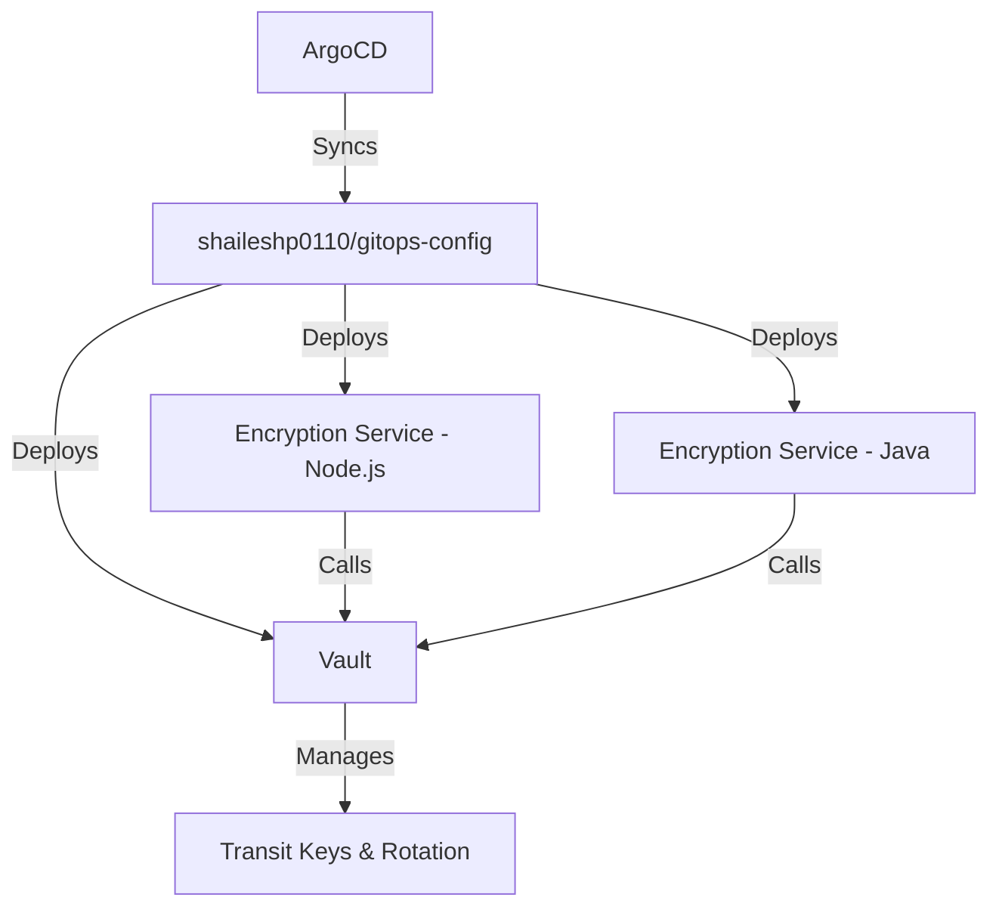

# Vault Key Rotation Demo — GitOps Walkthrough

I have implemented a production-grade GitOps architecture using two GitHub repositories and HashiCorp Vault.

## Architecture

This setup uses a dual-repository pattern:
1.  **Source Repo**: [shaileshp0110/kubernetes](https://github.com/shaileshp0110/kubernetes) - Contains application code and setup scripts.
2.  **Config Repo**: [shaileshp0110/gitops-config](https://github.com/shaileshp0110/gitops-config) - Contains Helm charts and ArgoCD Application manifests.

### Component Diagram


## Key Features

- **Dual-Key Support**: Demonstrates rotation for both **Symmetric (AES-256)** and **Asymmetric (RSA-2048)** keys.
- **Multi-Language Demo**: Proves interoperability between Node.js and Java using Vault as a shared encryption provider.
- **Full GitOps**: Uses the "App of Apps" pattern where a top-level `dev-environment` Application manages all other services.
- **Vault Transit Engine**: Handles encryption-as-a-service, allowing data to stay encrypted while keys are rotated in the background.

## Running the Demo locally

1.  **Start the environment**:
    ```bash
    ./infrastructure/setup-minikube.sh
    ```
    This script builds the container images locally inside Minikube and bootstraps ArgoCD.

2.  **Verify Synchronization**:
    Access the ArgoCD UI (credentials provided by the script) to see your services syncing from your GitHub repositories.

3.  **Run Rotation Test**:
    ```bash
    ./infrastructure/demo-rotation.sh
    ```
    This script will:
    - Encrypt a message with the Node.js service.
    - Rotate the key in Vault.
    - Decrypt the original message with the Java service.
    - Prove that old data is still readable after a rotation.

## Summary of Fixes Applied
- **Manifest Cleanup**: Fixed `env` variable formatting to match the Helm chart's expected array structure.
- **DNS names**: Used `fullnameOverride` in Helm values to ensure predictable DNS names during the demo.
- **Local Compatibility**: Set `image.pullPolicy: Never` for services built locally in the Minikube Docker daemon.
